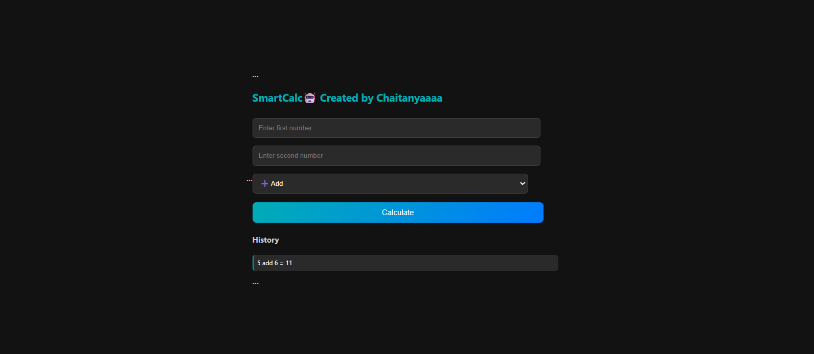
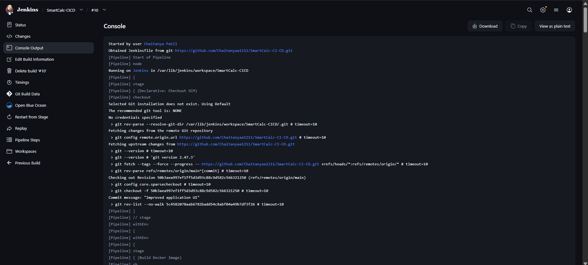
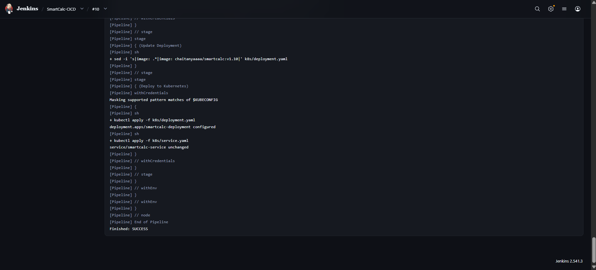
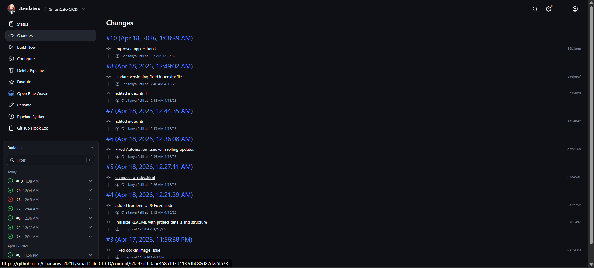
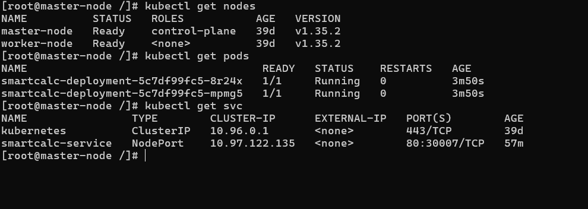

#  SmartCalc CI/CD Project (Jenkins + Docker + Kubernetes) 
➗✔️➕✖️

## 📌 Project Overview

This project demonstrates a **production-style CI/CD pipeline** for deploying a containerized Node.js application on Kubernetes using Jenkins.

The goal of this project was to understand how modern DevOps workflows operate — from writing application code to automating deployments in a Kubernetes cluster.

---

## 🧠 What I Built

* A **Node.js-based calculator application** with API + simple frontend UI
* Containerized the application using Docker
* Set up a **multi-node Kubernetes cluster (Master + Worker)**
* Created Kubernetes manifests to deploy and expose the application
* Built a **Jenkins pipeline** to automate build and deployment

---

## ⚙️ Tech Stack

* Node.js (Backend + API)
* Docker (Containerization)
* Kubernetes (Container Orchestration)
* Jenkins (CI/CD Automation)
* GitHub (Source Code Management)

---

## 🏗️ Architecture

```
GitHub → Jenkins → Docker Build → Docker Hub → Kubernetes → Application
```

---

## 📂 Project Structure

```
smartcalc-cicd/
│
├── app/                  # Node.js application
├── k8s/                  # Kubernetes manifests
└── screenshots/          # Project Screenshots             
├── Dockerfile            # Docker build instructions
├── Jenkinsfile           # CI/CD pipeline
├── .gitignore
└── README.md
```

---

## 🔄 CI/CD Pipeline Flow

1. Code is pushed to GitHub
2. Jenkins pulls the latest code
3. Docker image is built
4. Image is pushed to Docker Hub
5. Kubernetes deployment is updated
6. Application is deployed automatically

---

## ☸️ Kubernetes Setup

* Multi-node cluster (Master + Worker)
* Deployment with multiple replicas
* Service (NodePort) to expose application
* Rolling updates enabled for zero downtime
* Liveness & readiness probes configured

---

## 🌐 Application Features

* Basic calculator operations (Add, Subtract, Multiply, Divide)
* History tracking of calculations
* Health check endpoint (`/health`)
* Version endpoint (`/version`)
* Simple frontend UI for interaction

---
---

## 🧪 Key Learnings

* Understanding CI/CD pipeline flow in real-world scenarios
* Debugging Kubernetes issues like pod failures and image pulls
* Working with Docker images and container lifecycle
* Automating deployments using Jenkins pipelines
* Managing Kubernetes deployments with zero downtime

---

## ⚠️ Challenges & Solutions

- Fixed Kubernetes deployment not updating due to static image tags
- Implemented dynamic image tagging using Jenkins build numbers
- Resolved Docker caching issues using --no-cache builds


---

## 🎯 Conclusion

This project helped me gain hands-on experience with **DevOps tools and workflows**, especially in building and automating deployments in a Kubernetes environment.

---
## Project Screenshots

## SmartCalc App UI 🎨

---
## Jenkins Pipeline Start ⚡

---
## Jenkins Pipeline Finish ✅

---
## Jenkins Version Changes

---
## K8s Pods & Service Running >_

